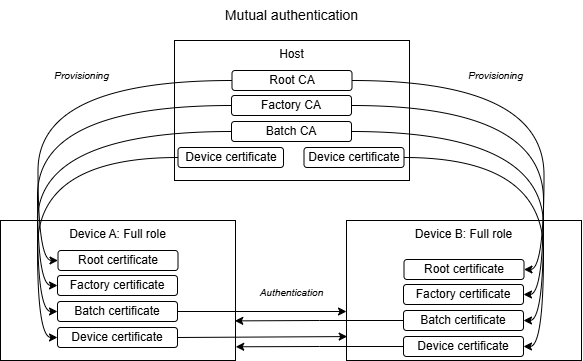
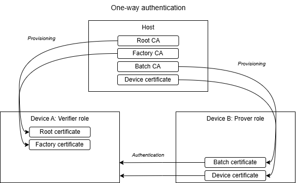

# SoC - Certificate-Based Authentication and Pairing

This example application demonstrates how to create secure connections with trusted devices, where the trust between the devices is based on certificates instead of classical authentication methods such as numeric comparison or passkey entry. This method ensures authenticated connections without any user interaction.

> **Note: This example project is at EXPERIMENTAL quality level and is not meant to be used in production!**

## Provisioning

This example expects the device to be provisioned and prepared properly. This can be done with the **Bluetooth - SoC CBAP Dynamic Data Provisioning** application. Before proceeding, please read the readme of this application and complete the provisioning process.
- For prover devices, this include the presence of an elliptic curve (EC) key pair, and properly signed device and the batch certificates.
- For verifier devices, the factory and root certificates are required.
- For the full-role, every data is required that belongs to the prover role and the verifier role.

## Configuration

From the CBAP perspective, these are the most important configurations:

- `CBAP Role` This determines the CBAP role. A device can be the verifier, prover, or both (full). Can be set in the *sl_bt_cbap_config.h* configuration header. (Otherwise, look for the CBAP component in the **Software Component** browser, and configure it using the GUI.)
- `Connection role` This determines the BLE connection role of the device. A device can be either the peripheral (server) or central (client). A peripheral device advertises itself, and presents its GATT table to the central, which scans and initiates the connection. Can be set in the *app_config.h* configuration header. (Or on the Overview tab, under Project Details, open the three-dots-menu, and click **Configuration**.)

The two roles are independent of each other.

### Which CBAP Roles Work Together

For a connection, we need at least two devices, one of them set to be the central, and the other to be the peripheral. Note that one central can connect with multiple peripheral devices, and one peripheral devices with multiple centrals as well.

As for the CBAP role:
- A full-role device only accepts connections with other full-role devices
- A verifier is only compatible with provers
- And a prover is only compatible with verifiers

## Mutual (symmetrical) authentication

This setup requires (at least) two devices with the *full* CBAP role selected. Both of them should be provisioned accordingly. In this case both device requires the authentication of the other (*verifier*), and both have the ability to prove themselves to the other (*prover*). Therefore, we call this mutual, or symmetrical authentication.

At initialization both devices validates their own certificate chain. Then, the peripheral devices starts to advertise itself, with the advertisement containing the CBAP UUID. The central device starts to scan, and searches for such advertisement. When found, it connects, starting the CBAP procedure. The two devices send each other their own batch, and device certificates. On the other side, the remote receives them, and completes the certificate chain with its own factory and root certificates. Then, it validates the chain. This means the verification of whether each certificate is issued by the next one. (Trust can only be gained, if the remote certificate derives from the same chain - in our case: our factory Certificate Authority has issued the remote batch certificate.)

If the device certificate can be trusted, the procedure continues with the key challenge. Since certificates are public information, the remote device shall prove that it has the private part of the key, that belongs to that device certificate. Once the two device pass the key challenge, the authentication is complete. Both device trust each other, and so finally they create an authenticated secure connection using OOB (Out-Of-Band) data, where the OOB data is signed by the devices' private keys.

## One-way (asymmetrical) authentication

This setup requires (at least) two devices as well. One being the *verifier*, and the other is the *prover*. Both of them should be provisioned accordingly. In this case, only the *verifier* device wishes to authenticate the *prover* device.

A prover presents its batch and device certificates and signs the OOB data with its device key. A verifier validates what it receives against its own factory and root certificates.

> **Note:** A prover only device has no trust anchor, so it cannot tell who it is talking to. It signs the OOB data of whoever asks, and the resulting link is encrypted with an authenticated key without the remote device having been authenticated. Use a prover only role where that is acceptable, for example on a device that is authenticated by a gateway and carries no secrets of its own. Configure the role as Full where both sides have to be authenticated.

## Security capabilities and limitations

The CBAP component drives the CBAP procedure and the Bluetooth Stack Security Manager settings. It starts the CBAP procedure with a candidate device, and increases the stack security level on success. It disconnects on failure, and the app adds the remote to the disallow list. These devices will be omitted if found again.

> **Note:** A successful CBAP procedure leaves the connection in security mode 1, level 4, so it is encrypted with an authenticated key. This protects the characteristics of the GATT database that **require an authenticated and encrypted connection**, and nothing else. A characteristic that can be read or written without security stays accessible to every device that connects, whether it passed CBAP or not!

The Digital characteristic of the Automation IO service in `gatt_configuration.btconf` shows how this is expressed. Both its read and its write properties are marked as authenticated and encrypted, therefore the LED can only be controlled once CBAP has succeeded. When adding characteristics of your own, set their security requirements accordingly: CBAP does not protect them by itself. At the end of the CBAP procedure, the application demonstrates this by the central blinking the LED on the peripheral device.

The authentication lasts as long as the connection. The devices are not bondable, so the keys of the pairing are not stored and a device that reconnects has to pass CBAP again.

## How the Example is Built Up

This example has two variants:
- **Bluetooth - SoC Certificate Based Authentication and Pairing (Secure Vault)** this is intended to be used with devices that contain Secure Vault part.
- **Bluetooth - SoC Certificate Based Authentication and Pairing (TrustZone)** this is compatible with devices that does not contain Secure Vault. This is a TrustZone workspace, that contains the a *secure application* and the *nonsecure application*.

The CBAP procedure itself is implemented by the **Certificate Based Authentication and Pairing** software component. The component owns the CBAP GATT service, drives the certificate exchange and the OOB challenge, configures the security manager and finally raises the security level of the connection. It reports the outcome of every procedure to the application through a callback. The component serves one procedure at a time.

The application is left with the Bluetooth tasks that depend on the product:

- It advertises or scans, depending on the configured connection role. A central device scans for the CBAP service UUID and opens the connection, a peripheral device advertises the UUID and waits to be connected.
- It stops advertising or scanning while a procedure is in progress, and starts it again afterwards, so that further devices can be authenticated.
- On success it stores the connection as trusted, and the central device writes the secured characteristic of the peripheral device, which blinks the LED of the peripheral device. The write is only permitted over an authenticated connection, so the blink is the proof of the outcome.
- On failure the device logs the error and it puts the Bluetooth address of the remote device on a disallowlist and does not start a new procedure with it. The size of the disallowlist is set by `DISALLOWLIST_SIZE` in the project configuration. The execution is asserted if a device has to be added to a full disallowlist. Reset the device to clear its disallowlist.

## Testing the Example

1. For the simplest setup, use two devices, both provisioned for the full role (both verifier and peripheral).
2. Generate the CBAP example for both.
3. Leave the `CBAP Role` configuration on `Both prover and verifier` (full).
4. Change the `Connection role` for one them to `Central` and leave the other one as `Peripheral`.
5. Connect the two devices and open the serial port to see the incoming loggings. For most visibility, make sure that the `Threshold` configuration of the `Log` component is set to `DEBUG`.
6. Build and flash the two projects.
7. On success, the LED is blinked on the peripheral device. The loggings should also reflect the success of the CBAP procedure.
8. Experiment by creating more central/peripheral devices and connect them to this small network!

## Troubleshooting

### Programming the Radio Board

Before programming the radio board mounted on the mainboard, make sure the power supply switch is in the AEM position (right side) as shown below.

## Resources

[AN1268: Authenticating Silicon Labs Devices Using Device Certificates](https://www.silabs.com/documents/public/application-notes/an1268-efr32-secure-identity.pdf)

[Bluetooth Documentation](https://docs.silabs.com/bluetooth/latest/)

[UG103.14: Bluetooth LE Fundamentals](https://www.silabs.com/documents/public/user-guides/ug103-14-fundamentals-ble.pdf)

[QSG169: Bluetooth SDK v3.x Quick Start Guide](https://www.silabs.com/documents/public/quick-start-guides/qsg169-bluetooth-sdk-v3x-quick-start-guide.pdf)

[UG434: Silicon Labs Bluetooth ® C Application Developer's Guide for SDK v3.x](https://www.silabs.com/documents/public/user-guides/ug434-bluetooth-c-soc-dev-guide-sdk-v3x.pdf)

[Bluetooth Training](https://www.silabs.com/support/training/bluetooth)

## Report Bugs & Get Support

You are always encouraged and welcome to report any issues you found to us via [Silicon Labs Community](https://www.silabs.com/community).
