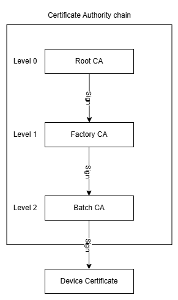

# SoC - CBAP Dynamic Data Provisioning

This application enables provisioning the device with data, required by the Certificate Based Authentication and Pairing (CBAP) application. This is a RAM application, therefore it leaves the original firmware untouched.

## Prerequisites

1. Install the required python packages:

        pip install -r script/requirements.txt
2. Obtain a root Certificate Authority. You can either use your own, or you can create it using this tool:

        python certificate_manager.py --level 0
  * This creates a root CA with the default configuration under this directory:

        ~/.silabs/certificates/ca0_root
  * Optionally, you can continue by creating intermediate CAs. To create a factory CA (level 1) and batch CA (level 2):

        python certificate_manager.py --level 1
        python certificate_manager.py --level 2
  * Similarly, the created CAs can be found under these directories:

        ~/.silabs/certificates/ca1_factory
        ~/.silabs/certificates/ca2_batch

  * This completes the chain. Each CA has signed the next one. The batch CA can be used for signing the device certificate. About the possible configurations please check the help message:

        python certificate_manager.py --help

## Usage

1. Build the project. Do not flash. Since this is a special application (RAM), it requires special handling.

> Note: Make sure there is no other serial/RTT connection opened between your device and your host machine during the provisioning process!
2. Run the provisioning script:

        python provision.py --ca_dir <path> --ca_level <ca_level>
  * To use the batch CA we created above:

        python provision.py --ca_dir ~/.silabs/certificates/ --ca_level 2
  * For testing purposes, you can use the bundled demo CA chain. In this case, just omit these arguments:

        python provision.py

> Note: This bundled Certificate Authority chain is for demonstration purposes only, and it is not meant to be used in production.

  * To see how you can configure the device certificate and the RTT connection, please check the help message:

        python provision.py --help

This provisioning script
- establishes RTT connection to the device.
- uploads and runs the DDP RAM application.
- and finally, runs the DDP commands in order to:
  - Generate a device key pair.
  - Generate static authentication data.
  - Generate a common name, based on the device's UUID.
  - Build the device certificate and sign it with the issuer.
  - Inject the certificate into the device.
  - Inject the selected CA into the device as well.

## Devices with small memory

The xG22 chip family does not have the necessary RAM size to run this application as intended. For these devices, this application behaves like a regular Flash-based application. Therefore, the provisioning process is the same, except for
- you need to flash (program) the device with this application before running the provisioning script.
- the provisioning will happen through serial (VCOM) communication instead of RTT.

Please refer to the help message of the provisioning script to see how you the serial connection can be configured.

> Note: In this case, the Flash will be overwritten with the provisioning application, therefore the target firmware needs to be re-programmed.

## Resources

[Certificate Based Authentication and Pairing (CBAP)](https://www.silabs.com/wireless/bluetooth/cbap)

[AN1396: Certificate-Based Bluetooth Authentication and Pairing](https://www.silabs.com/documents/public/application-notes/an1396-bluetooth-certificates.pdf)

[AN1268: Authenticating Silicon Labs Devices Using Device Certificates](https://www.silabs.com/documents/public/application-notes/an1268-efr32-secure-identity.pdf)

## Report Bugs & Get Support

You are always encouraged and welcome to report any issues you found to us via [Silicon Labs Community](https://www.silabs.com/community).
